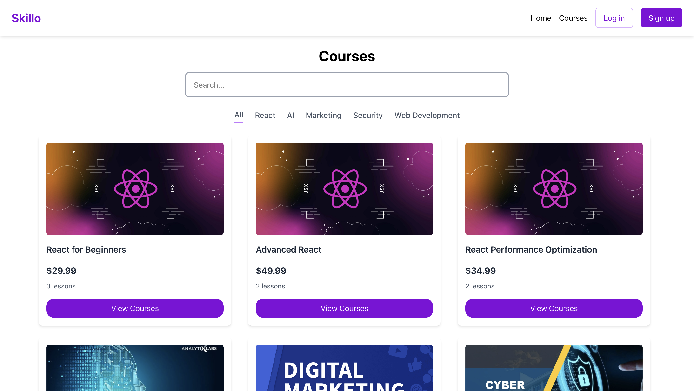
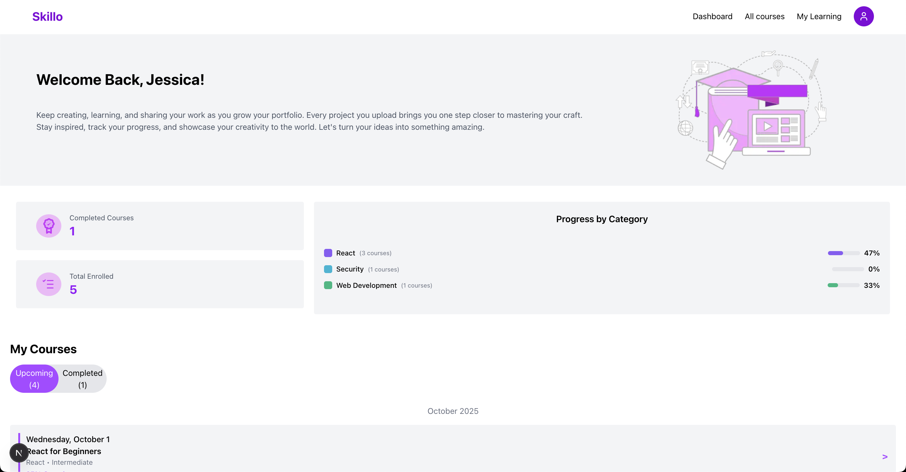
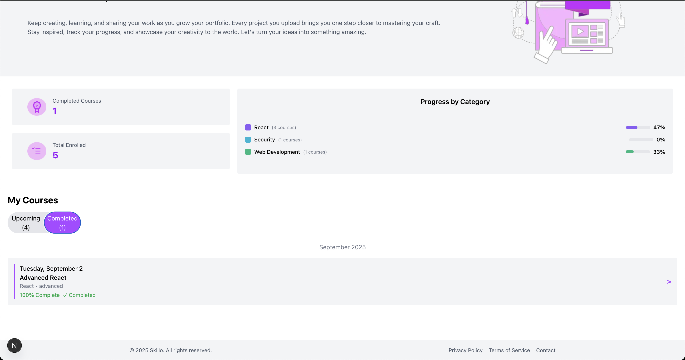
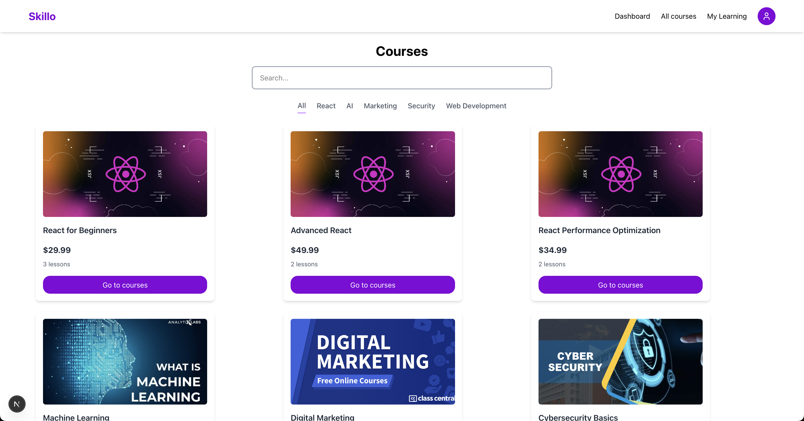
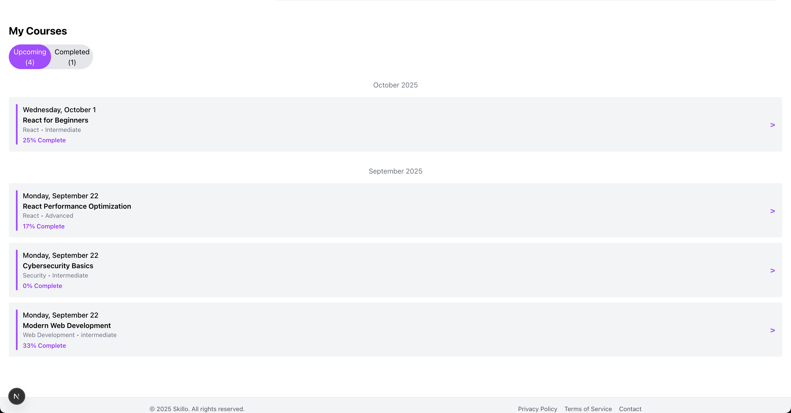
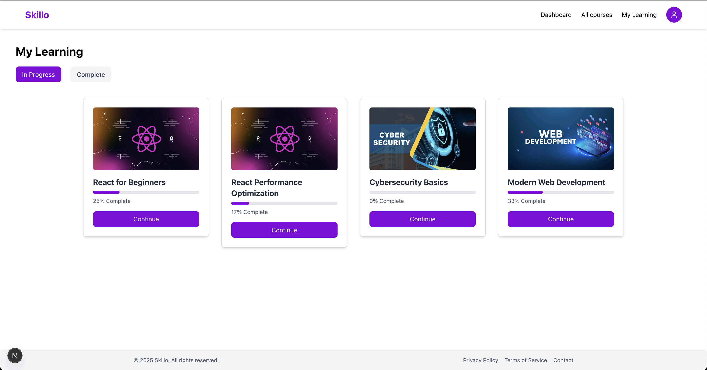
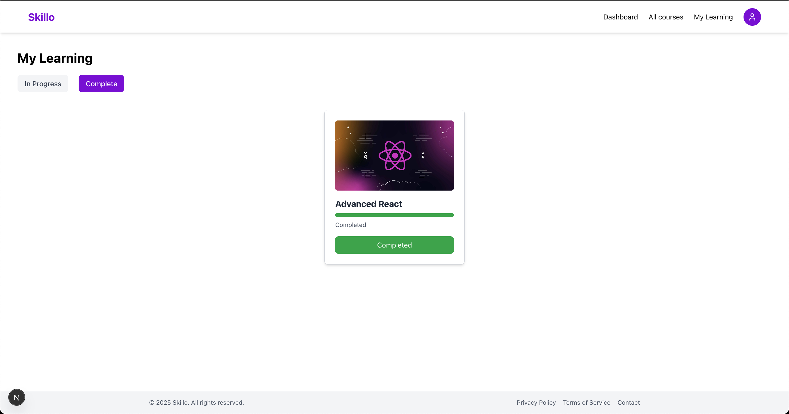
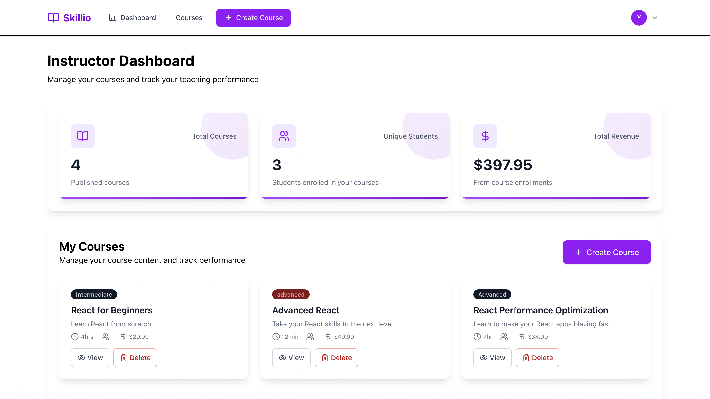
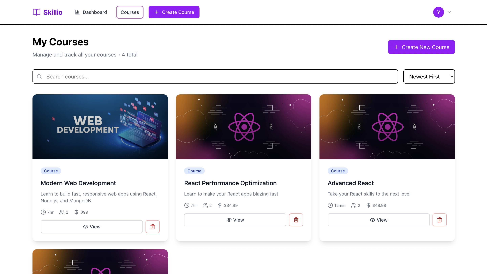
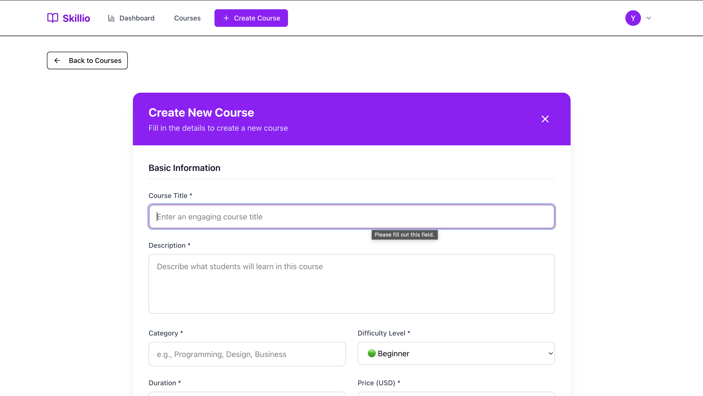

# Skillo

---

## Team Members
- Jessica Winn – [GitHub Repo](https://github.com/jessicawinn/Skillo)  
- Yunn Yamone Aung – [GitHub Repo](https://github.com/jessicawinn/Skillo)  

---

## About Our Project - Skillo
**Skillo** is a modern learning platform designed to connect students with hands-on workshops and courses.  
The platform allows educators to create, manage, and share workshops while students can explore, enroll, and track their learning journey.  

Skillo focuses on practical learning experiences with AI-powered recommendations, making it easier for students to find relevant workshops based on their interests and progress.

---

## Features
- Student profiles with completed and ongoing courses  
- AI-powered course recommendations  
- Educator dashboards for course/workshop management   
- Secure authentication using JWT & MongoDB  
- Azure Blob Storage for media uploads  

---

## Tech Stack
- **Framework:** Next.js (React)  
- **Backend:** Node.js + MongoDB  
- **Cloud Services:** Azure Blob Storage  
- **Language:** JavaScript / TypeScript  

---

## Screenshots

### Landing Page



### Student Dashboard



### Student Courses





### Instructor Dashboard




---

## How to Run
1. Clone the repository:
   ```bash
   git clone https://github.com/jessicawinn/Skillo.git
   cd Skillo
